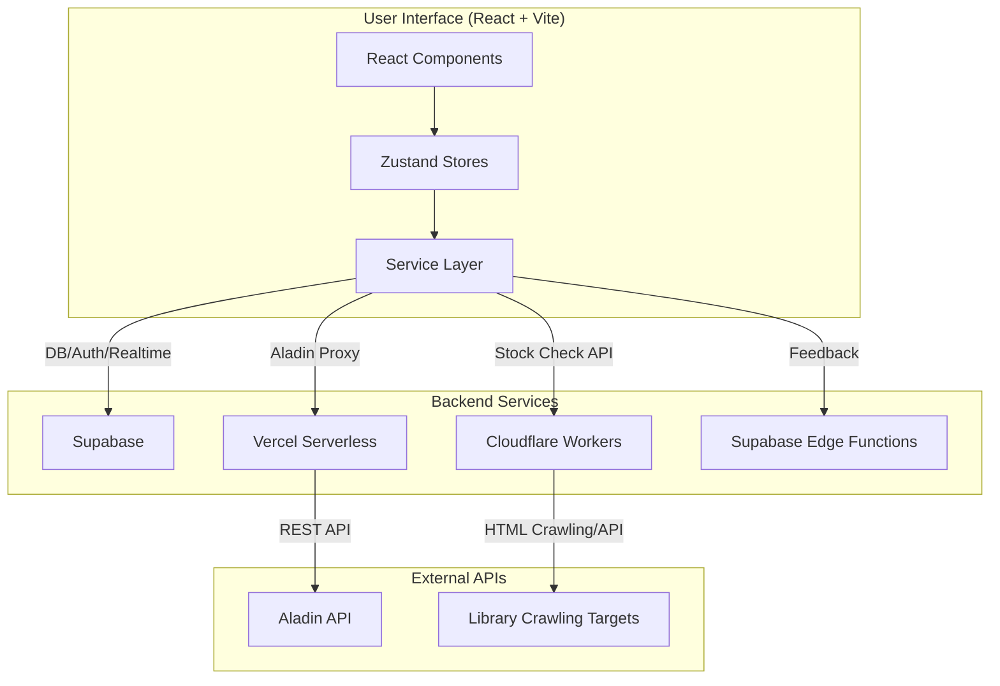
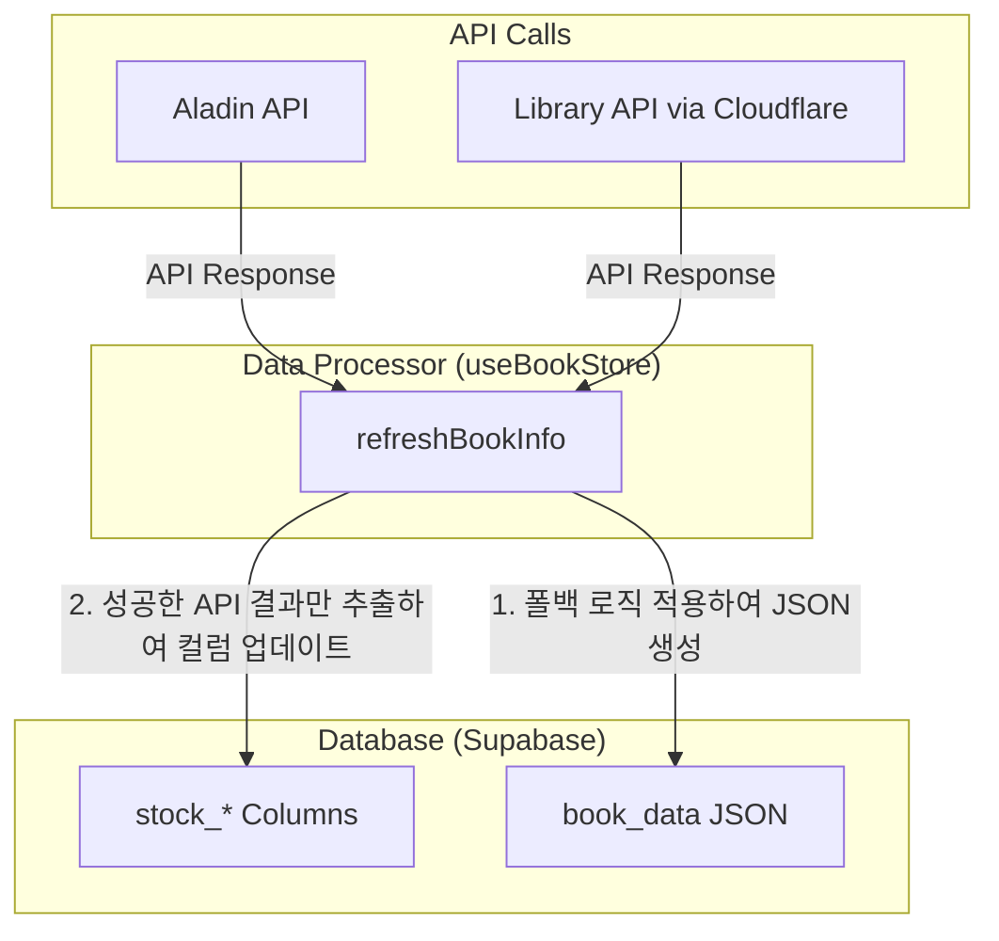

# 개발 가이드 (Development Guide)

마이북스테이션 프로젝트의 개발자를 위한 기술 문서입니다.

## 🏗️ 시스템 아키텍처

### 전체 아키텍처 개요


### 프론트엔드 아키텍처
- **컴포넌트**: UI를 구성하는 재사용 가능한 블록 (`/components`). `MyLibrary`와 같은 거대 컴포넌트는 `MyLibraryListItem`, `MyLibraryToolbar` 등으로 세분화하여 관리. **[수정]**
- **상태 관리 (Zustand)**: 전역 상태를 관리하는 훅 기반 스토어 (`/stores`).
  - `useAuthStore`: 사용자 인증 및 세션 관리
  - `useUIStore`: 모달, 알림 등 UI 상태 관리
  - `useBookStore`: 도서 데이터, 내 서재, API 연동 등 핵심 비즈니스 로직
  - `useSettingsStore`: 사용자 맞춤 설정 관리
- **서비스 계층**: 외부 API와의 통신을 담당하는 모듈 (`/services`).
  - `aladin.service.ts`: Vercel 프록시를 통해 알라딘 API 호출
  - `unifiedLibrary.service.ts`: Cloudflare Worker로 통합된 도서관 재고 API 호출, 도서관 링크 생성 담당
  - `feedback.service.ts`: Supabase Edge Function으로 피드백 전송
- **유틸리티**: 특정 도메인에 종속되지 않는 순수 함수 모음 (`/utils`).
  - `bookDataCombiner.ts`: API 응답을 내부 데이터 구조로 조합
  - `isbnMatcher.ts`: ISBN 기반으로 도서를 매칭하는 로직

## 📁 프로젝트 구조
```
my_bookstation/
├── api/                     # Vercel Serverless Functions (Aladin 프록시)
│   └── search.ts
├── components/              # React 컴포넌트
│   ├── layout/              # Header, Footer 등 레이아웃
│   ├── DevToolsFloat.tsx    # 관리자 전용 기능 모달 (구 AdminPanel.tsx)
│   ├── MyLibrary.tsx        # 컨테이너: 서재의 상태 및 비즈니스 로직 담당
│   ├── MyLibraryListItem.tsx # 프레젠테이셔널: 개별 책 아이템 UI
│   ├── MyLibraryToolbar.tsx  # 프레젠테이셔널: 서재 상단 툴바 UI
│   └── ... (기타 UI 컴포넌트)
├── library-checker/         # Cloudflare Workers (재고 확인 API)
│   └── src/index.ts         # TypeScript로 마이그레이션됨
├── services/                # API 서비스 계층
├── stores/                  # Zustand 상태 관리 스토어
├── supabase/                # Supabase 설정 및 Functions
│   └── functions/
│       └── send-feedback-email/ # 피드백 처리 Edge Function
├── utils/                   # 공통 유틸리티 함수
│   ├── adminCheck.ts        # 관리자 이메일 확인
│   ├── bookDataCombiner.ts  # 데이터 조합 로직
│   ├── isbnMatcher.ts       # ISBN 기반 도서 매칭
│   └── ...
├── App.tsx                  # 메인 애플리케이션 컴포넌트
├── types.ts                 # 전역 TypeScript 타입 정의 (Zod 기반)
└── ... (설정 파일)
```
**[수정]** 컴포넌트 분리 및 Worker의 TypeScript 전환을 반영하여 구조 설명을 업데이트했습니다.

## 🔧 기술 스택 상세

- **React 19 & TypeScript**: 최신 React 기능 활용 및 정적 타입 체킹.
- **Zustand**: 경량화된 전역 상태 관리.
- **Supabase**: PostgreSQL 데이터베이스, 인증, Row Level Security(RLS).
- **Cloudflare Workers**: 도서관 재고 크롤링 및 키워드 통합 검색 API 서버. **TypeScript** 기반이며 **Cache API**를 활용한 응답 캐싱. **[수정]**
- **Vercel Serverless Functions**: Aladin API 키 보호를 위한 프록시 서버.
- **Supabase Edge Functions**: 보안이 필요한 서버 사이드 로직 (피드백 이메일 전송).
- **Tailwind CSS**: 유틸리티 우선 CSS 프레임워크.
- **Zod**: 런타임 데이터 검증.

## 🚀 개발 환경 설정

### 로컬 개발 설정
1.  **저장소 클론 및 의존성 설치**
    ```bash
    git clone <repository-url>
    cd my_bookstation
    npm install
    ```
2.  **프론트엔드 환경 변수 설정** (`.env.local` 파일 생성 - Git 제외)
    ```env
    VITE_SUPABASE_URL=your_supabase_url
    VITE_SUPABASE_ANON_KEY=your_supabase_anon_key
    VITE_ALADIN_TTB_KEY=your_aladin_ttb_key
    ```
3.  **Cloudflare Workers 로컬 실행** (별도 터미널)
    ```bash
    cd library-checker
    npm install
    npm run dev
    ```
    - Worker는 기본적으로 `http://127.0.0.1:8787`에서 실행됩니다.
4.  **프론트엔드 개발 서버 실행**
    ```bash
    npm run dev
    ```


## 📊 API 명세

### 1. Aladin API 프록시 (Vercel Serverless)
- **엔드포인트**: `/api/search`
- **역할**: 클라이언트로부터 받은 검색 파라미터를 사용하여 서버 측에서 Aladin API를 호출합니다. TTB Key를 클라이언트에 노출하지 않습니다.

### 2. 통합 도서관 재고 API (Cloudflare Workers)
- **엔드포인트**:
  - 로컬: `http://127.0.0.1:8787`
  - 프로덕션: `https://library-checker.byungwook-an.workers.dev`
- **메서드**: `POST`
- **[수정] 요청 본문**:
  ```json
  {
    "isbn": "9791190538534",
    "author": "저자명",
    "eduTitle": "검색용 제목",
    "gyeonggiTitle": "검색용 제목",
    "siripTitle": "검색용 제목",
    "customTitle": "" // (Optional)
  }
  ```
- **[수정] 응답 본문 (성공 예시, 평탄화 및 camelCase로 표준화됨)**:
  ```json
  {
    "title": "...",
    "isbn": "...",
    "author": "...",
    "customTitle": "",
    "lastUpdated": 1761380372099,
    "gwangjuPaper": { "totalCountSummary": 10, ... },
    "gyeonggiEbookEdu": { "totalCountSummary": 1, ... },
    "gyeonggiEbookLib": { "totalCountSummary": 2, ... },
    "siripEbook": { "totalCountSummary": 3, "availableCountOwned": 1, ... }
  }
  ```

### 3. 키워드 통합 검색 API (Cloudflare Workers)
- **엔드포인트**: `/keyword-search`
- **메서드**: `POST`
- **요청 본문**: `{ "keyword": "검색어" }`
- **응답 본문**: 연결된 모든 도서관의 검색 결과를 정규화한 평탄화된 배열
  ```json
  [
    {
      "type": "종이책",
      "libraryName": "퇴촌",
      "title": "도서 제목",
      "author": "저자",
      "publisher": "출판사",
      "pubDate": "2024",
      "loanStatus": true
    },
    {
      "type": "전자책",
      "libraryName": "e경기",
      ...
    },
    ...
  ]
  ```

### 4. 사용자 피드백 API (Supabase Edge Function)
- **엔드포인트**: `https://<project>.supabase.co/functions/v1/send-feedback-email`
- **메서드**: `POST`
- **인증**: `Authorization: Bearer <User JWT>` (Supabase Auth)

---

## 📚 도서관별 검색어 및 URL 생성 시스템 (중앙화 관리)

**`services/unifiedLibrary.service.ts`** 파일의 **`createLibraryOpenURL`** 함수를 통해 모든 도서관 외부 링크 생성을 중앙에서 관리합니다. 이는 코드의 일관성을 유지하고 유지보수를 용이하게 합니다.

### 검색어 처리 로직 우선순위
1.  **커스텀 검색어**: 사용자가 책별로 지정한 `customSearchTitle`이 있으면 최우선으로 사용합니다.
2.  **자동 생성 검색어**: 커스텀 검색어가 없는 경우, `createOptimalSearchTitle(title)` 함수를 통해 원본 제목을 가공하여 사용합니다.
    - **`createOptimalSearchTitle`**: 제목에서 콜론(`:`), 하이픈(`-`), 괄호(`()[]_{}`) 등 부제를 나타내는 특수문자 이후의 내용을 제거하고, 앞 3단어만 추출하여 검색 정확도를 높입니다.

### URL 생성 규칙 (`createLibraryOpenURL`)

| LibraryName (`libraryName`) | 도서관 | 생성 URL 패턴 (GET 방식) | 비고 |
| :--- | :--- | :--- | :--- |
| `퇴촌` | 광주 퇴촌도서관 (종이책) | `.../resultList.do?searchLibraryArr=MN&searchKeyword={검색어}` | 웹 방화벽 우회를 위해 상세페이지 대신 검색 결과 페이지 사용 |
| `기타` | 광주 기타 시립도서관 (종이책)| `.../resultList.do?searchLibrary=ALL&searchKeyword={검색어}` | |
| `e교육` | 경기도 교육청 전자도서관 | `.../search/index.do?search_text={검색어}` | |
| `e시립구독`| 광주 시립 구독형 전자책 | `.../search/searchList.ink?schTxt={검색어}` | 교보문고 플랫폼 |
| `e시립소장`| 광주 시립 소장형 전자책 | `.../search/searchList.ink?schTxt={검색어}` | 예스24 플랫폼 |
| `e경기` | 경기도 전자도서관 | `.../search?keyword={검색어}` | 소장형/구독형 통합 검색 페이지 |

**클라이언트 코드 사용 예시:**
```typescript
import { createLibraryOpenURL } from '../services/unifiedLibrary.service';

// ... 컴포넌트 내부
const searchUrl = createLibraryOpenURL("e경기", book.title, book.customSearchTitle);
```

---

## 💾 데이터 흐름 및 처리 (Data Flow & Processing)

**[수정]** 이 섹션은 DB 컬럼 분리 아키텍처를 반영하여 전면 개정합니다.

본 프로젝트의 데이터 관리는 **"단일 진실 공급원(Single Source of Truth)"** 원칙과 **"데이터 안정성"**을 최우선으로 고려하여 설계되었습니다.

### 데이터 저장 아키텍처: 컬럼 분리와 JSON 저장소의 역할 분담

`user_library` 테이블은 두 가지 종류의 데이터를 저장하여 각자의 장점을 극대화합니다.

1.  **최상위 개별 컬럼 (`stock_*`, `note` 등):**
    -   **역할**: UI 표시에 직접 사용되는 핵심 데이터, 자주 조회/필터링되는 데이터를 저장합니다.
    -   **대상**: 도서관별 총 재고(`stock_*_total`), 대출 가능 수(`stock_*_available`), 사용자 메모(`note`) 등.
    -   **장점**:
        -   **성능**: 인덱싱을 통해 매우 빠른 조회 및 필터링이 가능합니다.
        -   **안정성**: `UPDATE` 시 특정 컬럼만 수정할 수 있어, 다른 데이터에 영향을 주지 않고 안전하게 업데이트할 수 있습니다.

2.  **`book_data` (JSONB 컬럼):**
    -   **역할**: API로부터 받은 원본 데이터, 서지 정보, 그리고 자주 변경되지 않는 기타 메타데이터의 "저장소(Repository)" 역할을 합니다.
    -   **대상**: 알라딘 API 응답 전문, 각 도서관 API의 상세 응답 객체(`gwangjuPaperInfo` 등).
    -   **장점**:
        -   **유연성**: 향후 API 응답에 새로운 필드가 추가되더라도 DB 스키마 변경 없이 유연하게 저장할 수 있습니다.
        -   **데이터 보존**: API 실패 시 데이터 복원(폴백)을 위한 원본 데이터를 보존합니다.

### 데이터 처리 파이프라인 요약



- **핵심 로직 (`refreshBookInfo`):**
    1.  **데이터 복원 (폴백):** API 호출이 실패한 정보에 대해서는, 기존 DB의 `book_data`에 저장된 과거 성공 데이터를 사용하여 `book_data`를 재구성합니다. **(데이터 유실 방지)**
    2.  **선택적 업데이트:** **성공한 API 응답에 대해서만** `stock_*` 컬럼을 업데이트합니다. 실패한 API에 해당하는 컬럼은 건드리지 않고 기존 값을 유지합니다. **(데이터 안정성)**

---

## 🎨 재고 정보 UI/UX 가이드라인

**[추가]** 이 섹션을 새로 추가합니다.

내 서재의 재고 정보 표시는 사용자에게 안정적이고 일관된 경험을 제공하기 위해 **"점진적 정보 공개(Progressive Disclosure)"** 원칙을 따릅니다. 목록 뷰에서는 안정적인 핵심 정보를 간결하게, 상세 뷰에서는 현재 상태를 포함한 상세 정보를 제공합니다.

### 색상 표시 기준

재고 정보 태그의 색상은 아래의 기준으로 결정됩니다.

| UI 색상 | CSS 클래스 (`status-*`) | 의미 |
| :--- | :--- | :--- |
| **🟩 녹색/파란색** | `status-available` | **재고 있음:** DB에 저장된 총 재고(`_total`)가 1 이상인 경우. |
| **⬜ 회색** | `status-none` | **정보 없음 또는 재고 없음:** DB에 저장된 총 재고(`_total`)가 `0`이거나 `NULL`(아직 조회 전)인 경우. |
| **🟥 빨간색** | `status-unavailable` | **조회 실패:** **상세 모달**에서만 표시되며, 현재 API 정보 갱신에 실패했음을 의미. |

### 동작 시나리오 비교


아래 표는 리팩토링 전후의 동작 방식을 비교하여, 새로운 UX 원칙이 어떻게 적용되는지 보여줍니다.

#### **(A) 상황: (DB에 없는) 새 책을 서재에 추가하는 경우**

| 단계 | 동작 | [변경 전] 동작 방식 | [변경 후] 동작 방식 |
| :--- | :--- | :--- | :--- |
| **1** | '서재에 추가' 버튼 클릭 | `book` 객체 생성. API 정보 필드는 `null`. | (동일) `book` 객체 생성. `stock_*` 및 API 정보 필드 모두 `null`. |
| **2** | UI에 즉시 표시 (API 응답 전) | `isError`가 `true`가 됨<br/>(`!book.gwangjuPaperInfo` 조건 때문에).<br/>**UI 색상: 🟥 빨간색 (에러)** | `isError`가 `false`가 됨<br/>(`!!book.gwangjuPaperInfo` 조건 때문에). `totalBooks`는 `0`.<br/>**UI 색상: ⬜ 회색 (정보 없음)** |
| **3** | 백그라운드 API 조회 성공 | `isError`는 `false`. `totalBooks` > 0.<br/>**UI 색상: 🟩 녹색/파란색 (재고 있음)** | (동일) `isError`는 `false`. `totalBooks` > 0.<br/>**UI 색상: 🟩 녹색/파란색 (재고 있음)** |
| **4** | 백그라운드 API 조회 실패 | `isError`는 `true`.<br/>**UI 색상: 🟥 빨간색 (에러)** | (동일) `isError`는 `true`.<br/>**UI 색상: 🟥 빨간색 (에러)** |

**✨ 개선점:** 새 책 추가 시 발생하는 불필요한 '에러' 상태(빨간색) 표시를 제거하여, 사용자에게 보다 안정적인 첫인상을 제공합니다.

---

#### **(B) 상황: (DB에 과거 '성공' 데이터가 있는) 기존 책을 조회/새로고침하는 경우**

| 단계 | 동작 | [변경 전] 동작 방식 | [변경 후] 동작 방식 |
| :--- | :--- | :--- | :--- |
| **1** | **내 서재 목록** 로드 | DB의 `stock_*` 값(`> 0`)을 사용. `isError`는 `false`.<br/>**UI 색상: 🟩 녹색/파란색** | `isError`를 무시하고 `stock_*` 값(`> 0`)만 사용.<br/>**UI 색상: 🟩 녹색/파란색** |
| **2** | '새로고침' 클릭 (API **실패** 시) | `isError`가 `true`가 됨. `totalBooks`는 과거 값 유지.<br/>**UI 색상: 🟥 빨간색 (에러)** | `isError`를 무시. `totalBooks`는 과거 값 유지.<br/>**UI 색상: 🟩 녹색/파란색 (유지)** |
| **3** | **상세 모달** 열기 (API **실패** 후) | `hasError`가 `true`.<br/>**UI 표시: 🟥 빨간색 + `(에러)`** | (동일) `hasError`가 `true`.<br/>**UI 표시: 🟥 빨간색 + `(에러)`** |

**✨ 개선점:** API 새로고침이 일시적으로 실패하더라도, **목록 뷰에서는 마지막으로 성공한 정보를 계속 보여주어** 안정적인 경험을 제공합니다. 사용자는 상세 정보에 진입해서만 현재의 '갱신 실패' 상태를 인지하게 됩니다.

---

#### **(C) 상황: (DB에 과거 '실패' 데이터가 있는) 기존 책을 조회/새로고침하는 경우**

| 단계 | 동작 | [변경 전] 동작 방식 | [변경 후] 동작 방식 |
| :--- | :--- | :--- | :--- |
| **1** | **내 서재 목록** 로드 | `stock_*`는 `NULL`(`totalBooks: 0`). `...Info`는 `{error}` 객체(`isError: true`).<br/>**UI 색상: 🟥 빨간색 (에러)** | `isError`를 무시. `stock_*`는 `NULL`(`totalBooks: 0`).<br/>**UI 색상: ⬜ 회색 (정보 없음)** |
| **2** | '새로고침' 클릭 (API **성공** 시) | DB 값 갱신. `isError`는 `false`.<br/>**UI 색상: 🟩 녹색/파란색 (재고 있음)** | (동일) DB 값 갱신.<br/>**UI 색상: 🟩 녹색/파란색 (재고 있음)** |
| **3** | **상세 모달** 열기 | `hasError`가 `true`. `totalCount`는 `undefined`.<br/>**UI 표시: 🟥 빨간색 + `(에러)`** | (동일) `hasError`가 `true`. `totalCount`는 `undefined`.<br/>**UI 표시: 🟥 빨간색 + `(에러)`** |

**✨ 개선점:** 과거에 조회 실패했던 책이 목록에서 계속 빨간색으로 표시되어 사용자에게 스트레스를 주던 문제를 해결했습니다. 이제 **회색(정보 없음)으로 차분하게 표시**하여, 사용자가 필요할 때 다시 조회하도록 유도합니다.

---

## 🗃️ 데이터베이스 유지보수 및 최적화 로그

이 섹션은 Supabase의 'Database Linter'를 통해 발견된 경고들을 해결하고, 프로젝트의 성능, 보안, 안정성을 향상시킨 내역을 기록합니다.

### **최종 수정일: 2025-11-02**

#### **요약**
Supabase 대시보드에서 보고된 성능 및 보안 관련 경고들에 대해 전면적인 검토 및 수정을 진행했습니다. 모든 주요 경고 항목을 해결하여 데이터베이스의 안정성과 확장성을 확보했습니다.

| 경고 유형 (Warning Type) | 상태 (Status) | 주요 조치 (Action Taken) |
| :--- | :--- | :--- |
| `vulnerable_postgres_version` | ✅ **완료** | 보안 패치가 포함된 최신 버전으로 PostgreSQL 업그레이드 완료. |
| `auth_rls_initplan` | ✅ **완료** | 모든 RLS 정책에서 `auth.uid()`를 `(select auth.uid())`로 변경하여 쿼리 성능 최적화. |
| `function_search_path_mutable`| ✅ **완료** | 모든 DB 함수에 `search_path`를 명시적으로 설정하여 보안 강화. |
| `extension_in_public` | ✅ **완료** | `pg_trgm` 확장 프로그램을 `extensions` 스키마로 분리하여 관리 효율성 증대. |
| `auth_otp_long_expiry` | ✅ **완료** | 이메일 OTP 만료 시간을 24시간(`86400s`)에서 10분(`600s`)으로 단축하여 보안 강화. |
| `auth_leaked_password_protection`| ⚠️ **확인** | 유료 플랜 기능으로 확인. 클라이언트 단에서 `zxcvbn` 라이브러리를 통한 비밀번호 강도 검사로 대체 권장. |

---

### **상세 조치 내역**

#### **1. RLS 정책 성능 최적화 (`auth_rls_initplan`)**

-   **문제점**: `user_library`, `user_settings`, `dev_notes` 테이블의 RLS 정책이 각 행마다 `auth.uid()` 함수를 반복 호출하여, 데이터 증가 시 심각한 성능 저하를 유발했습니다.
-   **해결 과정**:
    1.  `auth.uid()`를 서브쿼리 형태인 `(select auth.uid())`로 감싸, 쿼리 당 단 한 번만 실행되도록 수정했습니다.
    2.  초기 수정 시, `user_settings` 테이블에서 `uuid`와 `bigint` 타입 불일치 에러(`operator does not exist: uuid = bigint`)가 발생했습니다.
    3.  `Table Editor`에서 테이블 스키마를 직접 확인하여 `user_settings`와 `dev_notes` 테이블에서 사용자 식별 컬럼이 `id`가 아닌 `user_id`임을 파악하고, 이를 정책에 정확히 반영했습니다.
-   **최종 조치**: 아래 SQL 쿼리를 실행하여 모든 관련 RLS 정책을 성공적으로 최적화했습니다.

    ```sql
    -- user_library 테이블 정책 최적화
    ALTER POLICY "Allow individual read access" ON public.user_library USING (((select auth.uid()) = user_id));
    ALTER POLICY "Allow individual insert access" ON public.user_library WITH CHECK (((select auth.uid()) = user_id));
    ALTER POLICY "Allow individual update access" ON public.user_library USING (((select auth.uid()) = user_id)) WITH CHECK (((select auth.uid()) = user_id));
    ALTER POLICY "Allow individual delete access" ON public.user_library USING (((select auth.uid()) = user_id));
    
    -- user_settings 테이블 정책 최적화
    ALTER POLICY "Users can view own settings" ON public.user_settings USING (((select auth.uid()) = user_id));
    ALTER POLICY "Users can insert own settings" ON public.user_settings WITH CHECK (((select auth.uid()) = user_id));
    ALTER POLICY "Users can update own settings" ON public.user_settings USING (((select auth.uid()) = user_id));
    ALTER POLICY "Users can delete own settings" ON public.user_settings USING (((select auth.uid()) = user_id));
    
    -- dev_notes 테이블 정책 최적화
    ALTER POLICY "Users can view own dev notes" ON public.dev_notes USING (((select auth.uid()) = user_id));
    ALTER POLICY "Users can insert own dev notes" ON public.dev_notes WITH CHECK (((select auth.uid()) = user_id));
    ALTER POLICY "Users can update own dev notes" ON public.dev_notes USING (((select auth.uid()) = user_id));
    ALTER POLICY "Users can delete own dev notes" ON public.dev_notes USING (((select auth.uid()) = user_id));
    ```

#### **2. 함수 안정성 및 보안 강화 (`function_search_path_mutable`)**

-   **문제점**: 데이터베이스 함수들에 `search_path`가 고정되어 있지 않아, 잠재적인 스키마 하이재킹 공격에 취약했습니다.
-   **해결 과정**:
    1.  초기 수정 시, `get_books_by_tags` 와 `get_all_user_library_isbn` 함수에서 '함수가 존재하지 않는다'는 에러가 발생했습니다.
    2.  원인은 `ALTER FUNCTION` 구문에 사용된 함수의 인자(Signature)가 실제 데이터베이스에 정의된 것과 달랐기 때문입니다.
    3.  `pg_proc` 테이블을 조회하는 쿼리를 통해 모든 대상 함수의 정확한 인자 정보를 파악했습니다.
        -   `get_books_by_tags`: `(text[])`, `(text[], boolean)` 두 가지 오버로딩된 형태임을 확인.
        -   그 외 함수들: 인자를 받지 않는 형태임을 확인.
-   **최종 조치**: 정확한 함수 서명(Signature)을 사용하여 아래 SQL 쿼리를 실행, 모든 함수의 `search_path`를 `public`으로 고정했습니다.

    ```sql
    -- 인자가 있는 함수 수정
    ALTER FUNCTION public.get_books_by_tags(text[]) SET search_path = 'public';
    ALTER FUNCTION public.get_books_by_tags(text[], boolean) SET search_path = 'public';
    
    -- 인자가 없는 함수 수정
    ALTER FUNCTION public.get_all_user_library_isbn() SET search_path = 'public';
    ALTER FUNCTION public.get_all_user_library_isns() SET search_path = 'public';
    ALTER FUNCTION public.get_tag_counts_for_user() SET search_path = 'public';
    ALTER FUNCTION public.keep_alive() SET search_path = 'public';
    ALTER FUNCTION public.update_updated_at_column() SET search_path = 'public';
    ```

#### **3. 데이터베이스 구조 개선 및 기타 보안 조치**

-   **확장 프로그램 스키마 분리 (`extension_in_public`)**: `pg_trgm` 확장 프로그램을 `public` 스키마에서 전용 `extensions` 스키마로 이전하여 관리 효율성을 높였습니다.
    ```sql
    CREATE SCHEMA IF NOT EXISTS extensions;
    ALTER EXTENSION pg_trgm SET SCHEMA extensions;
    ```
-   **OTP 만료 시간 단축 (`auth_otp_long_expiry`)**: 이메일 인증 코드의 유효 시간을 24시간(`86400`초)에서 10분(`600`초)으로 대폭 단축하여 인증 보안을 강화했습니다.
    -   **수정 경로**: `Authentication` > `Sign In / Providers` > `Email` > `Email OTP Expiration`
  

---

## 🐛 트러블슈팅 가이드

*(기존 내용에 아래 내용을 추가 및 업데이트합니다.)*


이 섹션은 프로젝트 개발 중 발생했던 주요 문제들과 그 해결 과정을 기록하여, 유사 문제 발생 시 빠르고 효과적으로 대응하기 위한 가이드입니다.

---

### **[유형 1] 크롤링 실패: 세션 쿠키(Session Cookie)가 필요한 경우**

-   **대상 사이트**: 광주시립도서관 구독형 전자책
-   **증상**: 간헐적으로 `HTTP 400 Bad Request` 오류가 발생하며 크롤링 실패.
-   **원인 분석**: 대상 서버의 동적인 안티-스크래핑 정책. 서버는 단순히 쿠키 유무뿐만 아니라, **최초 접속 시의 요청 헤더 패턴**과 **단시간 내 연속적인 새 세션 요청 패턴** 등을 분석하여 봇을 탐지하고 차단한다.
-   **시행착오 및 교훈**:
    -   **실패한 접근 (KV 세션 캐싱):** 세션을 재사용하려는 시도는 Worker 환경의 동시성 문제로 인해 오히려 서버 차단을 유발하는 역효과를 낳았다.
    -   **성공한 접근 (단순 2단계 요청 + 헤더 강화):** 복잡한 상태 관리를 제거하고, **매 요청마다 독립적으로 새 세션을 발급받되, 각 요청(세션 획득/검색)의 헤더를 실제 브라우저와 거의 동일하게 모방**하는 것이 가장 안정적이었다.
-   **최종 해결 전략**: "매번 새로운 세션을 요청하는 단순한 패턴"과 "정교한 브라우저 헤더 위장"을 결합.
    1.  **1단계 (세션 획득):** `Sec-Fetch-*` 등 전체 브라우저 헤더를 모방하여 첫 접속 요청을 보낸다.
    2.  **2단계 (검색 수행):** 획득한 쿠키와 `Referer` 헤더를 포함하여, 페이지 내 정상 이동처럼 보이는 검색 요청을 보낸다.
-   **핵심 교훈**: 크롤링 시 상태 관리(Statefulness)의 복잡성은 신중하게 고려해야 하며, 때로는 가장 단순한 Stateless 접근법이 더 견고할 수 있다. **(상세 히스토리는 `docs/crawling_troubleshooting_guide` 참조)**

---

### **[유형 2] 크롤링 실패: 동적 인증 토큰(Dynamic Token)이 필요한 경우**

-   **대상 사이트**: 경기도 전자도서관 구독형 전자책
-   **증상**: `401 Unauthorized` 또는 `403 Forbidden` 오류가 발생하며, 일반적인 헤더 구성으로는 요청이 거부됩니다.
-   **원인 분석**: 서버가 매 요청마다 실시간으로 생성된 **시간 기반 동적 인증 토큰**을 `token` 헤더에 요구합니다. 이 토큰이 없거나 유효하지 않으면 요청이 차단됩니다.
-   **해결 전략**: 도서관 사이트의 JavaScript 코드를 분석하여 토큰 생성 규칙을 파악하고, 이를 Worker 코드 내에서 그대로 재현합니다.

    1.  **1단계: KST 시간 생성**
        -   서버가 한국 표준시(KST, UTC+9)를 기준으로 시간을 검증하므로, `new Date(new Date().getTime() + 9 * 60 * 60 * 1000)` 코드를 통해 KST 현재 시간을 계산합니다.

    2.  **2단계: 토큰 문자열 조합**
        -   생성된 KST 시간을 `YYYYMMDDHHMM` 형식의 문자열로 변환합니다.
        -   이 타임스탬프와 서버가 지정한 고정 ID(`0000000685`)를 쉼표로 연결하여 원본 토큰 문자열을 만듭니다. (예: `202510271530,0000000685`)

    3.  **3단계: Base64 인코딩**
        -   조합된 토큰 문자열을 Base64로 인코딩합니다. 이때, 실행 환경(Cloudflare Worker의 `btoa` / Node.js의 `Buffer`)에 맞는 함수를 사용해야 합니다.

    4.  **4단계: 인증된 검색 (Authenticated Search)**
        -   검색 API 엔드포인트(`https://api.bookers.life/...`)로 `POST` 요청을 보냅니다.
        -   요청 헤더의 **`token` 필드**에 3단계에서 생성한 동적 토큰을 담아 전송합니다.

    **핵심 코드 (`library-checker/src/index.js`):**
    ```javascript
    // (경기도 전자도서관 구독형 검색 함수 내)
    // 1 & 2. KST 시간 기반 토큰 문자열 생성
    const now = new Date(new Date().getTime() + 9 * 60 * 60 * 1000);
    const timestamp = /* YYYYMMDDHHMM 형식으로 변환 */;
    const tokenString = `${timestamp},0000000685`;
    
    // 3. Base64 인코딩 (Cloudflare 환경)
    const dynamicToken = btoa(tokenString);

    // 4. 토큰을 헤더에 담아 POST 요청
    const response = await fetch(url, {
      method: 'POST',
      headers: {
        'token': dynamicToken,
        'Content-Type': 'application/json;charset=UTF-8',
        'Referer': 'https://ebook.library.kr/',
        // ... 기타 헤더
      },
      body: JSON.stringify({ search: query, /* ... */ })
    });
    ```
-   **교훈**: 두 사례는 크롤링 시 마주치는 대표적인 인증 패턴입니다. `40x` 계열 오류 발생 시, 단순 헤더 변경 외에 **다단계 인증(세션 쿠키) 또는 동적 토큰** 요구 여부를 반드시 확인해야 합니다.


### **[유형 3] 캐싱 실패: 동일한 요청에도 계속 Cache MISS가 발생하는 경우**
*(기존 내용을 최신 정보로 업데이트)*
-   **원인 분석**: `POST` 요청은 기본적으로 캐싱되지 않으며, `Response` 객체에 `Cache-Control` 헤더가 없어 캐시가 저장되지 않았음.
-   **해결 전략**:
    1.  **안정적인 캐시 키 생성**: `POST` 요청 본문을 해싱하여 고유 경로를 가진 `GET` 메서드의 `Request` 객체를 캐시 키로 사용.
    2.  **`Cache-Control` 헤더 명시**: `Response` 객체에 `'Cache-Control': 'public, max-age=43200'` (12시간) 헤더를 명시적으로 추가하여 캐시 저장을 강제.
    3.  **에러 응답 캐싱 방지**: 오류가 포함된 응답에는 `'Cache-Control': 'no-store'`를 설정하여 캐시 오염 방지.

### **[유형 5] [신규 추가] 초기 로딩 데이터에만 기능이 작동하는 경우**
-   **증상:** '내 서재' 검색 또는 태그 필터링 후 나타난 책에 대해 특정 기능(예: 상세 모달 열기, 재고 새로고침, 태그/메모 CRUD)이 작동하지 않음.
-   **원인 분석: 제한된 데이터 소스 참조**: 특정 기능을 수행하는 함수가 업데이트할 객체를 오직 `myLibraryBooks` 배열에서만 찾으려고 시도하기 때문에 발생.
-   **해결 방안: 중앙화된 데이터 조회 함수 사용**:
    1.  **`getBookById` 함수 활용**: 모든 잠재적인 데이터 소스( `myLibraryBooks`, `librarySearchResults` 등)를 검색하고, 없으면 DB에 직접 요청하는 `getBookById` 함수를 사용하도록 수정.
    2.  **UI 상태 동시 업데이트**: 데이터 업데이트 시, 모든 관련 상태 배열(`myLibraryBooks`, `librarySearchResults` 등)을 동시에 업데이트하여 UI 일관성 유지.

### **[유형 6] [신규 추가] 일괄 재고 갱신 시 `socket hang up` 에러 발생**
-   **증상**: '일괄 재고 갱신' 실행 시, API 요청이 서버의 Rate Limiting에 의해 강제 종료됨.
-   **원인 분석**: 배치(batch) 단위로만 지연을 적용하여, 배치 내의 개별 요청들은 동시에 전송되었음.
-   **해결 전략**: `bulkRefreshAllBooks` 함수 내 `setTimeout` 지연 로직을 **개별 책(book) 요청 사이로 이동**. 각 책 갱신 후 200ms의 지연 시간을 두어 API 서버 부하를 분산.


### [유형 7] 초기 로딩된 데이터에만 기능이 작동하는 경우

**증상:**
-   '내 서재' 검색 또는 태그 필터링 후 나타난 책에 대해 특정 기능(예: 상세 모달 열기, 재고 새로고침, 태그/메모 CRUD)이 작동하지 않는다.
-   반면, 페이지를 처음 로드했을 때 보이는 책들(예: 25/50권)에 대해서는 동일한 기능이 정상적으로 작동한다.
-   React 개발자 도구에서는 상태 변경이 일어나는 것처럼 보이지만, UI에는 아무런 변화가 없다.

**원인 분석: 제한된 데이터 소스 참조 (The "Wrong Drawer" Problem)**

이 문제는 대부분의 경우 프론트엔드 상태 관리 로직에서 발생합니다. 우리 프로젝트는 성능을 위해 초기에는 일부 데이터(`myLibraryBooks`)만 로드하고, 검색/필터 시에는 별도의 상태(`librarySearchResults`, `libraryTagFilterResults`)를 사용합니다.

문제는 특정 기능을 수행하는 함수(예: `updateBookInStoreAndDB`, `refreshAllBookInfo`)가 업데이트할 대상 객체를 찾을 때, **오직 `myLibraryBooks`라는 하나의 "서랍"에서만** 객체를 찾으려고 시도하기 때문에 발생합니다. 만약 사용자가 다른 서랍(`librarySearchResults`)에 있는 객체에 대해 작업을 요청하면, 함수는 대상을 찾지 못하고 아무것도 하지 않거나 에러를 반환합니다.

**진단 워크플로우:**

1.  **기능 확인**: 작동하지 않는 기능(예: `addTagToBook`)이 의존하는 핵심 함수(예: `updateBookInStoreAndDB`)를 `useBookStore.ts`에서 찾습니다.
2.  **데이터 소스 추적**: 해당 함수가 업데이트할 원본 객체(`originalBook`)를 어디서 가져오는지 확인합니다. 아래와 같은 코드가 있다면 의심해야 합니다.
    ```typescript
    const { myLibraryBooks } = get();
    const originalBook = myLibraryBooks.find(b => b.id === id); // << 문제의 코드
    ```
3.  **재현**: '내 서재'에서 '전체 보기'를 누르지 않은 상태로, 스크롤을 내려 보이지 않는 책의 제목을 검색합니다. 검색 결과로 나온 책에 대해 해당 기능을 실행했을 때 문제가 재현되는지 확인합니다.

**해결 방안: 중앙화된 데이터 조회 함수 사용**

이 문제를 근본적으로 해결하려면, 객체를 찾을 때 모든 잠재적인 데이터 소스를 검색하는 중앙화된 조회 함수를 사용해야 합니다.

1.  **`getBookById` 함수 활용**:
    `useBookStore.ts`에 이미 `getBookById` 함수가 구현되어 있습니다. 이 함수는 `myLibraryBooks`, `librarySearchResults`, `libraryTagFilterResults`를 모두 검색하고, 그래도 없으면 DB에 직접 요청하는 가장 견고한 방법입니다.

2.  **기존 코드 수정**:
    문제가 되는 함수 내부에서 `myLibraryBooks.find(...)`를 사용하는 대신, `getBookById`를 호출하도록 수정합니다.

    **수정 전:**
    ```typescript
    const { myLibraryBooks } = get();
    const originalBook = myLibraryBooks.find(b => b.id === id);
    if (!originalBook) return;
    // ...
    ```

    **수정 후:**
    ```typescript
    const { getBookById } = get();
    const originalBook = await getBookById(id);
    if (!originalBook) return;
    // ...
    ```

3.  **UI 상태 동시 업데이트**:
    데이터를 업데이트하는 함수(`updateBookInStoreAndDB`, `refreshAllBookInfo`)는 `setState`를 호출할 때 **모든 관련 상태 배열**(`myLibraryBooks`, `librarySearchResults`, `libraryTagFilterResults`)을 동시에 업데이트해야 합니다. 이를 통해 어떤 뷰(기본, 검색, 필터)에 있더라도 UI가 일관되게 변경됩니다.

    ```typescript
    // 좋은 예시
    useBookStore.setState(state => ({
      myLibraryBooks: state.myLibraryBooks.map(b => (b.id === id ? updatedBook : b)),
      librarySearchResults: state.librarySearchResults.map(b => (b.id === id ? updatedBook : b)),
      libraryTagFilterResults: state.libraryTagFilterResults.map(b => (b.id === id ? updatedBook : b)),
    }));
    ```

**핵심 원칙**: 사용자 인터랙션의 대상이 되는 객체를 찾거나 수정할 때는, 현재 화면에 보이는 데이터의 출처(`myLibraryBooks`, `librarySearchResults` 등)와 관계없이, **존재하는 모든 데이터 소스를 포괄하는 단일 통로(`getBookById`)**를 통해 접근해야 합니다.


### [유형 8] API 조회 실패 시 "조회중..."이 무한 반복되는 경우

-   **증상**: 상세 정보 모달에서 특정 재고 정보가 "조회중..."으로 계속 표시되고 멈춥니다.
-   **원인**: API 조회 실패 시 DB에 해당 필드가 `null`로 저장됩니다. UI 컴포넌트가 `!book.someInfo` 와 같이 `null`을 `false`로 해석하여 로딩 상태로 오판하기 때문입니다.
-   **해결**: `MyLibraryBookDetailModal`의 `StockDisplay` 컴포넌트에서 로딩 상태 판단 조건을 `!book.someInfo`에서 `book.someInfo === undefined`로 수정했습니다. 이를 통해 `undefined`(아직 로드 전)와 `null`(API 조회 실패 또는 데이터 없음)을 명확히 구분하여 처리합니다.


### [유형 9] 경기도 광주시 퇴촌도서관 상세페이지 웹 방화벽 차단
- **증상**: 크롤링 데이터에 포함된 상세페이지 URL(`resourcedetail/detail.do?...`)로 직접 접근 시 "Web firewall security policies have been blocked" 에러 페이지가 표시됨.
- **원인**: 도서관 시스템의 보안 정책 강화로 외부에서의 상세페이지 직접 링크가 차단됨.
- **해결**: `createLibraryOpenURL` 함수에서 '퇴촌' 케이스 처리 시, 상세페이지 URL 대신 **제목 기반 검색 결과 페이지 URL**을 생성합니다. 사용자는 검색 결과 목록에서 해당 도서를 클릭하여 상세 정보를 확인할 수 있습니다.

### [유형 10] API 요청 타임아웃 (전체 응답 지연)
- **증상**: 하나의 도서관 서버 응답이 지연되면 전체 재고 조회(`Promise.allSettled`)가 늦어짐.
- **해결**: Cloudflare Worker(`library-checker/src/index.js`)에서 각 도서관 `fetch` 요청에 `AbortSignal.timeout(15000)` (15초)을 설정했습니다. 특정 서버가 15초 내에 응답하지 않으면 해당 요청만 실패 처리하고 나머지 결과를 반환합니다.

### [유형 11] 경기도 전자도서관 검색 결과 0건 (특수문자 문제)
- **증상**: 책 제목에 특수문자가 포함된 경우 검색 결과가 0건으로 나옴.
- **해결**: API 호출 방식을 복잡한 `detailQuery` 파라미터 대신, 실제 웹사이트 검색창과 동일하게 동작하는 `keyword` 파라미터 방식으로 변경하여 검색 정확도를 높였습니다.


네, 알겠습니다. 구 버전과 신 버전 `DEVELOPMENT.md`의 핵심적인 차이점을 명확하게 비교하고 정리해 드리겠습니다. 이 비교는 최근 진행된 대규모 리팩토링의 기술적 깊이와 의사결정 과정을 이해하는 데 큰 도움이 될 것입니다.

---

## **`DEVELOPMENT.md` 구 버전 vs. 신 버전 핵심 차이점 비교 - 2025-11-10**

한마디로 요약하면, **구 버전**이 "프로젝트가 어떻게 동작하는가"를 설명하는 **단순 설명서**였다면, **신 버전**은 "왜 이렇게 설계되었고, 어떤 문제를 해결했으며, 어떻게 안정성을 유지하는가"를 설명하는 **체계적인 기술 아키텍처 문서**로 진화했습니다.

아래는 섹션별 상세 비교입니다.

#### **1. 데이터 아키텍처 및 흐름 (`Data Flow & Processing` 섹션)**

*   **[구 버전]**
    *   모든 도서 정보를 단일 `book_data` JSON에 저장하는 단순한 흐름만 설명했습니다.
    *   데이터 유실 가능성이나 API 실패 시의 대응(폴백 로직)에 대한 언급이 부족했습니다.
    *   `schemaVersion`을 이용한 동적 마이그레이션이라는, 현재는 폐기된 복잡한 아키텍처를 설명하고 있었습니다.

*   **[신 버전] 💎 핵심 차이점: 안정성 중심의 아키텍처 명문화**
    *   **"컬럼 분리 아키텍처"**를 명확히 정의합니다. 즉, UI 표시용 핵심 데이터(`stock_*`)와 원본 데이터 저장소(`book_data`)의 역할을 분담하는 현재의 견고한 구조를 설명합니다.
    *   `refreshBookInfo`의 핵심 동작인 **"선택적 폴백(Fallback)"**과 **"선택적 업데이트"** 전략을 명시하여, API 실패 시에도 데이터 안정성을 어떻게 확보하는지 기술적인 근거를 제시합니다.
    *   Mermaid 다이어그램을 수정하여, 데이터가 DB에 저장될 때 두 경로(`stock_*` 컬럼, `book_data` JSON)로 나뉘어 저장되는 현재의 흐름을 정확하게 시각화합니다.

#### **2. UI/UX 가이드라인 (`재고 정보 UI/UX 가이드라인` 섹션)**

*   **[구 버전]**
    *   해당 내용이 **존재하지 않았습니다.** UI가 어떻게 동작하는지에 대한 규칙이 문서화되지 않았습니다.

*   **[신 버전] 💎 핵심 차이점: 디자인 원칙과 동작 시나리오의 구체화**
    *   **"점진적 정보 공개"**라는 UX 디자인 원칙을 도입하여, 목록 뷰와 상세 뷰의 역할이 다름을 명시합니다.
    *   재고 정보의 **색상 표시 기준(녹색/회색/빨간색)을 명확한 표로 정의**하여, 개발자가 UI 동작을 쉽게 이해하고 일관성을 유지할 수 있도록 합니다.
    *   **3가지 주요 시나리오**(신규 추가, 과거 성공, 과거 실패)에 대한 **변경 전/후 비교표**를 통해, 최근 UX 개선 작업의 목표와 성과를 구체적으로 보여줍니다.

#### **3. 트러블슈팅 가이드 (`Troubleshooting Guide` 섹션)**

*   **[구 버전]**
    *   과거에 해결했던 일부 문제들에 대한 해결책만 기록되어 있었습니다.
    *   최근 발생하고 해결된 복잡한 문제들에 대한 내용이 누락되어 있었습니다.

*   **[신 버전] 💎 핵심 차이점: 살아있는 기술 지식 베이스로의 진화**
    *   **최신 문제 해결 경험 추가:**
        *   **캐싱 실패:** `Cache-Control` 헤더와 `GET` 요청 키를 사용한 근본적인 해결책을 상세히 기록.
        *   **`socket hang up` 에러:** 일괄 갱신 시 개별 요청 딜레이를 적용한 해결책 기록.
        *   **초기 로딩 데이터 문제:** `getBookById`를 통한 중앙화된 데이터 조회 해결책 기록.
    *   **기술적 의사결정 기록:** 왜 `schemaVersion` 시스템을 폐기했는지, 왜 특정 크롤링 방식을 채택했는지 등 **"왜 그렇게 결정했는가"**에 대한 배경을 기록하여, 향후 동일한 실수를 방지하고 프로젝트의 기술적 맥락을 공유합니다.

#### **4. 전반적인 최신성 및 정확성**

*   **[구 버전]**
    *   Cloudflare Worker가 JavaScript(`index.js`)로 작성되어 있고, 컴포넌트 구조가 분리되기 전의 상태를 설명했습니다.
    *   API 명세가 `snake_case`와 중첩 구조를 가진 옛날 버전을 기준으로 작성되어 있었습니다.

*   **[신 버전] 💎 핵심 차이점: 현재 코드베이스와의 완벽한 동기화**
    *   **기술 스택:** Worker가 **TypeScript** 기반임을 명시하고, **Cache API** 활용을 강조합니다.
    *   **프로젝트 구조:** `MyLibrary` 컴포넌트 분리(`MyLibraryListItem` 등)를 반영합니다.
    *   **API 명세:** 모든 필드명이 `camelCase`로 표준화되고, `siripEbook` 구조가 평탄화된 최신 API 응답 구조를 정확히 반영합니다.

---
**총평:** 신규 `DEVELOPMENT.md`는 단순한 코드 설명서를 넘어, 프로젝트의 **설계 철학, 핵심 아키텍처, 문제 해결의 역사, 그리고 디자인 원칙**까지 담아낸 포괄적인 **"기술 백서"**의 역할을 수행합니다. 이는 프로젝트의 안정성과 유지보수성을 한 단계 끌어올리는 매우 중요한 자산입니다.

---
**문서 최종 수정일**: 2025-11-10
```