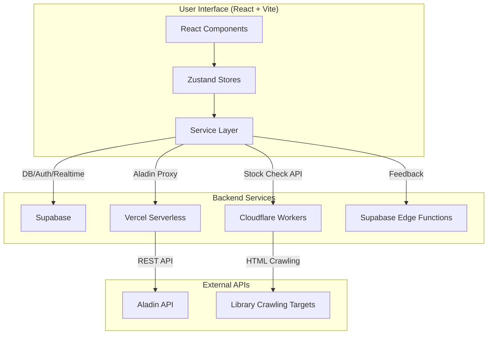

# 개발 가이드 (Development Guide)

마이북스테이션 프로젝트의 개발자를 위한 기술 문서입니다.

## 🏗️ 시스템 아키텍처

### 전체 아키텍처 개요


### 프론트엔드 아키텍처
- **컴포넌트**: UI를 구성하는 재사용 가능한 블록 (`/components`)
- **상태 관리 (Zustand)**: 전역 상태를 관리하는 훅 기반 스토어 (`/stores`)
  - `useAuthStore`: 사용자 인증 및 세션 관리
  - `useUIStore`: 모달, 알림 등 UI 상태 관리
  - `useBookStore`: 도서 데이터, 내 서재, API 연동 등 핵심 비즈니스 로직
  - `useSettingsStore`: 사용자 맞춤 설정 관리
- **서비스 계층**: 외부 API와의 통신을 담당하는 모듈 (`/services`)
  - `aladin.service.ts`: Vercel 프록시를 통해 알라딘 API 호출
  - `unifiedLibrary.service.ts`: Cloudflare Worker로 통합된 도서관 재고 API 호출, 도서관 링크 생성 담당
  - `feedback.service.ts`: Supabase Edge Function으로 피드백 전송

## 📁 프로젝트 구조

```
my_bookstation/
├── api/                     # Vercel Serverless Functions (Aladin 프록시)
│   └── search.ts
├── components/              # React 컴포넌트
│   ├── layout/              # Header, Footer 등 레이아웃
│   ├── AdminPanel.tsx       # 관리자 전용 기능 모달
│   ├── BookSearchListModal.tsx # 도서 검색 결과 모달
│   ├── MyLibrary.tsx        # 개인 서재 (핵심 기능)
│   ├── MyLibraryBookDetailModal.tsx # 내 서재 상세 정보 모달
│   └── ... (기타 UI 컴포넌트)
├── library-checker/         # Cloudflare Workers (재고 확인 API)
│   └── src/index.js
├── services/                # API 서비스 계층
│   ├── aladin.service.ts
│   └── unifiedLibrary.service.ts
├── stores/                  # Zustand 상태 관리 스토어
│   ├── useAuthStore.ts
│   ├── useBookStore.ts
│   ├── useSettingsStore.ts
│   └── useUIStore.ts
├── supabase/                # Supabase 설정 및 Functions
│   └── functions/
│       └── send-feedback-email/ # 피드백 처리 Edge Function
├── utils/                   # 공통 유틸리티 함수
│   ├── adminCheck.ts        # 관리자 이메일 확인
│   ├── isbnMatcher.ts       # ISBN 기반 도서 매칭
│   └── ...
├── App.tsx                  # 메인 애플리케이션 컴포넌트
├── types.ts                 # 전역 TypeScript 타입 정의
└── ... (설정 파일)
```

## 🔧 기술 스택 상세

- **React 19 & TypeScript**: 최신 React 기능 활용 및 정적 타입 체킹
- **Zustand**: 경량화된 전역 상태 관리
- **Supabase**: PostgreSQL 데이터베이스, 인증, Row Level Security(RLS)
- **Cloudflare Workers**: 도서관 재고 크롤링 및 키워드 통합 검색 API 서버
- **Vercel Serverless Functions**: Aladin API 키 보호를 위한 프록시 서버
- **Supabase Edge Functions**: 보안이 필요한 서버 사이드 로직 (피드백 이메일 전송)
- **Tailwind CSS**: 유틸리티 우선 CSS 프레임워크
- **Zod**: 런타임 데이터 검증

## 🚀 개발 환경 설정

### 로컬 개발 설정
1.  **저장소 클론 및 의존성 설치**
    ```bash
    git clone <repository-url>
    cd my_bookstation
    npm install
    ```
2.  **프론트엔드 환경 변수 설정** (`.env.local` 파일 생성 - Git 제외)
    ```env
    VITE_SUPABASE_URL=your_supabase_url
    VITE_SUPABASE_ANON_KEY=your_supabase_anon_key
    VITE_ALADIN_TTB_KEY=your_aladin_ttb_key
    ```
3.  **Cloudflare Workers 로컬 실행** (별도 터미널)
    ```bash
    cd library-checker
    npm install
    npm run dev
    ```
    - Worker는 기본적으로 `http://127.0.0.1:8787`에서 실행됩니다.
4.  **프론트엔드 개발 서버 실행**
    ```bash
    npm run dev
    ```

## 📊 API 명세

### 1. Aladin API 프록시 (Vercel Serverless)
- **엔드포인트**: `/api/search`
- **역할**: 클라이언트로부터 받은 검색 파라미터를 사용하여 서버 측에서 Aladin API를 호출합니다. 이를 통해 TTB Key를 클라이언트에 노출하지 않습니다.

### 2. 통합 도서관 재고 API (Cloudflare Workers)
- **엔드포인트**:
  - 로컬: `http://127.0.0.1:8787`
  - 프로덕션: `https://library-checker.byungwook-an.workers.dev`
- **메서드**: `POST`
- **요청 본문**:
  ```json
  {
    "isbn": "9791165211387",      // 종이책 검색용 ISBN
    "eduTitle": "일 잘하는 사람은", // 경기도 교육청 도서관 검색용 제목
    "gyeonggiTitle": "일 잘하는 사람은", // 경기도 전자도서관 검색용 제목
    "siripTitle": "일 잘하는 사람은",    // 광주 시립 전자도서관 검색용 제목
    "customTitle": "사용자 지정 검색어" // (Optional) 지정 시 위 3개 title 대신 사용
  }
  ```
- **응답 본문 (예시)**:
  ```json
  {
    "title": "일 잘하는 사람은", // 요청 시 사용된 최종 검색어
    "isbn": "9791165211387",
    "gwangju_paper": {
      "book_title": "일 잘하는 사람은 단순하게 말합니다",
      "availability": [
        {
          "소장도서관": "퇴촌도서관",
          "청구기호": "325.26-박55일",
          "대출상태": "대출가능",
          "반납예정일": "-"
        },
        ...
      ]
    },
    "gyeonggi_ebook_edu": [
      {
        "소장도서관": "성남도서관",
        "도서명": "일 잘하는 사람은 알기 쉽게 말한다",
        "대출상태": "대출가능",
        ...
      },
      ...
    ],
    "gyeonggi_ebook_library": {
      "library_name": "경기도 전자도서관",
      "total_count": 4,
      "available_count": 4,
      "owned_count": 2,
      "subscription_count": 2,
      "books": [
        {
          "title": "일 잘하는 사람은 알기 쉽게 말한다",
          "type": "소장형",
          "isLoanable": true,
          ...
        },
        ...
      ]
    },
    "sirip_ebook": {
      "sirip_ebook_summary": {
        "library_name": "광주시립중앙도서관-통합",
        "total_count": 1,
        "available_count": 1,
        ...
      },
      "details": {
        "owned": { "total_count": 0, "books": [] },
        "subscription": {
          "total_count": 1,
          "books": [
            {
              "type": "구독형",
              "title": "일 잘하는 사람은 논어에서 배운다",
              "isAvailable": true,
              ...
            }
          ]
        }
      }
    }
  }
  ```

### 3. 키워드 통합 검색 API (Cloudflare Workers)
- **엔드포인트**: `/keyword-search`
- **메서드**: `POST`
- **요청 본문**: `{ "keyword": "검색어" }`
- **응답 본문**: 연결된 모든 도서관의 검색 결과를 정규화한 평탄화된 배열
  ```json
  [
    {
      "type": "종이책",
      "libraryName": "퇴촌",
      "title": "도서 제목",
      "author": "저자",
      "publisher": "출판사",
      "pubDate": "2024",
      "isAvailable": true
    },
    {
      "type": "전자책",
      "libraryName": "e경기",
      ...
    },
    ...
  ]
  ```

### 4. 사용자 피드백 API (Supabase Edge Function)
- **엔드포인트**: `https://<project>.supabase.co/functions/v1/send-feedback-email`
- **메서드**: `POST`
- **인증**: `Authorization: Bearer <User JWT>` (Supabase Auth)

---

## 📚 도서관별 검색어 및 URL 생성 시스템 (중앙화 관리)

**`services/unifiedLibrary.service.ts`** 파일의 **`createLibraryOpenURL`** 함수를 통해 모든 도서관 외부 링크 생성을 중앙에서 관리합니다. 이는 코드의 일관성을 유지하고 유지보수를 용이하게 합니다.

### 검색어 처리 로직 우선순위
1.  **커스텀 검색어**: 사용자가 책별로 지정한 `customSearchTitle`이 있으면 최우선으로 사용합니다.
2.  **자동 생성 검색어**: 커스텀 검색어가 없는 경우, `createOptimalSearchTitle(title)` 함수를 통해 원본 제목을 가공하여 사용합니다.
    - **`createOptimalSearchTitle`**: 제목에서 콜론(`:`), 하이픈(`-`), 괄호(`()[]_{}`) 등 부제를 나타내는 특수문자 이후의 내용을 제거하고, 앞 3단어만 추출하여 검색 정확도를 높입니다.

### URL 생성 규칙 (`createLibraryOpenURL`)

| LibraryName (`libraryName`) | 도서관 | 생성 URL 패턴 (GET 방식) | 비고 |
| :--- | :--- | :--- | :--- |
| `퇴촌` | 광주 퇴촌도서관 (종이책) | `.../resultList.do?searchLibraryArr=MN&searchKeyword={검색어}` | 웹 방화벽 우회를 위해 상세페이지 대신 검색 결과 페이지 사용 |
| `기타` | 광주 기타 시립도서관 (종이책)| `.../resultList.do?searchLibrary=ALL&searchKeyword={검색어}` | |
| `e교육` | 경기도 교육청 전자도서관 | `.../search/index.do?search_text={검색어}` | |
| `e시립구독`| 광주 시립 구독형 전자책 | `.../search/searchList.ink?schTxt={검색어}` | 교보문고 플랫폼 |
| `e시립소장`| 광주 시립 소장형 전자책 | `.../search/searchList.ink?schTxt={검색어}` | 예스24 플랫폼 |
| `e경기` | 경기도 전자도서관 | `.../search?keyword={검색어}` | 소장형/구독형 통합 검색 페이지 |

**클라이언트 코드 사용 예시:**
```typescript
import { createLibraryOpenURL } from '../services/unifiedLibrary.service';

// ... 컴포넌트 내부
const searchUrl = createLibraryOpenURL("e경기", book.title, book.customSearchTitle);
```

---


## 💾 데이터 흐름 및 처리 (Data Flow & Processing)

`useBookStore`가 API 응답을 받아 DB에 저장하는 과정은 단순한 데이터 저장을 넘어, 화면 표시에 최적화된 형태로 데이터를 가공하는 중요한 파이프라인을 포함합니다. 이 핵심 로직은 `utils/bookDataCombiner.ts` 파일의 두 가지 유틸리티 함수를 통해 관리됩니다.

### 데이터 조합 함수의 역할 분리

우리 애플리케이션은 두 가지 목적을 위해 API 응답을 조합합니다.

1.  **데이터 확인 (Debugging & Verification)**: 개발자나 사용자가 시스템이 API로부터 받은 원본 데이터를 그대로 확인해야 할 때.
2.  **데이터 저장 및 표시 (Storage & Display)**: 화면 컴포넌트에서 사용하기 편리하도록 데이터를 가공하고 요약하여 DB에 저장하거나 UI에 렌더링해야 할 때.

이 두 가지 상이한 목적을 달성하기 위해, 두 개의 분리된 함수를 사용합니다.

#### 1. `combineRawApiResults` (데이터 확인용)

-   **역할**: 알라딘 API와 도서관 API의 응답을 **가공 없이 그대로 병합**합니다.
-   **목적**: API 테스트 모달이나 상세 정보의 'API 보기' 기능에서 시스템이 수신한 원본(Raw) 데이터를 투명하게 보여주기 위함입니다.
-   **구조**:
    ```json
    {
      "_source_aladin_api": { ... }, // 알라딘 API 원본
      "_source_library_api": { ... }  // 도서관 API 원본
    }
    ```
-   **주요 사용처**: `APITestContent.tsx`, `MyLibraryBookDetailModal.tsx`

#### 2. `combineApiResults` (DB 저장 및 화면 표시용)

-   **역할**: 두 API 응답을 조합하여 화면 표시에 최적화된 **"순수 API 데이터 객체"를 생성**합니다.
-   **목적**: `useBookStore`의 `refreshBookInfo` 함수에서 DB에 저장할 `book_data`의 API 정보 부분을 구성하기 위함입니다.
-   **주요 가공 로직 (CRUD)**:
    -   **(Create)** `toechonStock`, `otherStock`, `ebookInfo`, `filteredGyeonggiEbookInfo` 등 요약/파생 데이터를 생성합니다.
    -   **(Read/Copy)** `gwangjuPaperInfo` 등 원본 정보를 그대로 복사합니다.
    -   **(Update/Rename)** `gyeonggi_ebook_library`를 `gyeonggiEbookInfo`로 키 이름을 변경하는 등 데이터 구조를 재구성합니다.
    -   **(Delete)** 불필요하거나 중복되는 최상위 키(`title`, `isbn` 등)를 제거합니다.
-   **주요 사용처**: `useBookStore.ts` 내 `refreshBookInfo` 함수

### 데이터 처리 파이프라인 요약

```mermaid
graph TD
    subgraph "API Calls"
        A[Aladin API]
        L[Library API]
    end

    subgraph "Data Combiner (utils)"
        CR[combineRawApiResults]
        CP[combineApiResults]
    end

    subgraph "Application"
        UI[UI Components <br>(APITest, DetailModal)]
        STORE[useBookStore <br>(refreshBookInfo)]
        DB[(Supabase DB <br> book_data)]
    end

    A --> CR
    L --> CR
    CR -- "Raw Data" --> UI

    A --> CP
    L --> CP
    CP -- "Processed Data" --> STORE
    STORE -- "Merge with User Data" --> DB


## 🐛 트러블슈팅 가이드

### 경기도 광주시 퇴촌도서관 상세페이지 웹 방화벽 차단
- **증상**: 크롤링 데이터에 포함된 상세페이지 URL(`resourcedetail/detail.do?...`)로 직접 접근 시 "Web firewall security policies have been blocked" 에러 페이지가 표시됨.
- **원인**: 도서관 시스템의 보안 정책 강화로 외부에서의 상세페이지 직접 링크가 차단됨.
- **해결**: `createLibraryOpenURL` 함수에서 '퇴촌' 케이스 처리 시, 상세페이지 URL 대신 **제목 기반 검색 결과 페이지 URL**을 생성합니다. 사용자는 검색 결과 목록에서 해당 도서를 클릭하여 상세 정보를 확인할 수 있습니다.

### API 요청 타임아웃 (전체 응답 지연)
- **증상**: 하나의 도서관 서버 응답이 지연되면 전체 재고 조회(`Promise.allSettled`)가 늦어짐.
- **해결**: Cloudflare Worker(`library-checker/src/index.js`)에서 각 도서관 `fetch` 요청에 `AbortSignal.timeout(15000)` (15초)을 설정했습니다. 특정 서버가 15초 내에 응답하지 않으면 해당 요청만 실패 처리하고 나머지 결과를 반환합니다.

### 경기도 전자도서관 검색 결과 0건 (특수문자 문제)
- **증상**: 책 제목에 특수문자가 포함된 경우 검색 결과가 0건으로 나옴.
- **해결**: API 호출 방식을 복잡한 `detailQuery` 파라미터 대신, 실제 웹사이트 검색창과 동일하게 동작하는 `keyword` 파라미터 방식으로 변경하여 검색 정확도를 높였습니다.

### 초기 로딩된 데이터에만 기능이 작동하는 경우

**증상:**
-   '내 서재' 검색 또는 태그 필터링 후 나타난 책에 대해 특정 기능(예: 상세 모달 열기, 재고 새로고침, 태그/메모 CRUD)이 작동하지 않는다.
-   반면, 페이지를 처음 로드했을 때 보이는 책들(예: 25/50권)에 대해서는 동일한 기능이 정상적으로 작동한다.
-   React 개발자 도구에서는 상태 변경이 일어나는 것처럼 보이지만, UI에는 아무런 변화가 없다.

**원인 분석: 제한된 데이터 소스 참조 (The "Wrong Drawer" Problem)**

이 문제는 대부분의 경우 프론트엔드 상태 관리 로직에서 발생합니다. 우리 프로젝트는 성능을 위해 초기에는 일부 데이터(`myLibraryBooks`)만 로드하고, 검색/필터 시에는 별도의 상태(`librarySearchResults`, `libraryTagFilterResults`)를 사용합니다.

문제는 특정 기능을 수행하는 함수(예: `updateBookInStoreAndDB`, `refreshAllBookInfo`)가 업데이트할 대상 객체를 찾을 때, **오직 `myLibraryBooks`라는 하나의 "서랍"에서만** 객체를 찾으려고 시도하기 때문에 발생합니다. 만약 사용자가 다른 서랍(`librarySearchResults`)에 있는 객체에 대해 작업을 요청하면, 함수는 대상을 찾지 못하고 아무것도 하지 않거나 에러를 반환합니다.

**진단 워크플로우:**

1.  **기능 확인**: 작동하지 않는 기능(예: `addTagToBook`)이 의존하는 핵심 함수(예: `updateBookInStoreAndDB`)를 `useBookStore.ts`에서 찾습니다.
2.  **데이터 소스 추적**: 해당 함수가 업데이트할 원본 객체(`originalBook`)를 어디서 가져오는지 확인합니다. 아래와 같은 코드가 있다면 의심해야 합니다.
    ```typescript
    const { myLibraryBooks } = get();
    const originalBook = myLibraryBooks.find(b => b.id === id); // << 문제의 코드
    ```
3.  **재현**: '내 서재'에서 '전체 보기'를 누르지 않은 상태로, 스크롤을 내려 보이지 않는 책의 제목을 검색합니다. 검색 결과로 나온 책에 대해 해당 기능을 실행했을 때 문제가 재현되는지 확인합니다.

**해결 방안: 중앙화된 데이터 조회 함수 사용**

이 문제를 근본적으로 해결하려면, 객체를 찾을 때 모든 잠재적인 데이터 소스를 검색하는 중앙화된 조회 함수를 사용해야 합니다.

1.  **`getBookById` 함수 활용**:
    `useBookStore.ts`에 이미 `getBookById` 함수가 구현되어 있습니다. 이 함수는 `myLibraryBooks`, `librarySearchResults`, `libraryTagFilterResults`를 모두 검색하고, 그래도 없으면 DB에 직접 요청하는 가장 견고한 방법입니다.

2.  **기존 코드 수정**:
    문제가 되는 함수 내부에서 `myLibraryBooks.find(...)`를 사용하는 대신, `getBookById`를 호출하도록 수정합니다.

    **수정 전:**
    ```typescript
    const { myLibraryBooks } = get();
    const originalBook = myLibraryBooks.find(b => b.id === id);
    if (!originalBook) return;
    // ...
    ```

    **수정 후:**
    ```typescript
    const { getBookById } = get();
    const originalBook = await getBookById(id);
    if (!originalBook) return;
    // ...
    ```

3.  **UI 상태 동시 업데이트**:
    데이터를 업데이트하는 함수(`updateBookInStoreAndDB`, `refreshAllBookInfo`)는 `setState`를 호출할 때 **모든 관련 상태 배열**(`myLibraryBooks`, `librarySearchResults`, `libraryTagFilterResults`)을 동시에 업데이트해야 합니다. 이를 통해 어떤 뷰(기본, 검색, 필터)에 있더라도 UI가 일관되게 변경됩니다.

    ```typescript
    // 좋은 예시
    useBookStore.setState(state => ({
      myLibraryBooks: state.myLibraryBooks.map(b => (b.id === id ? updatedBook : b)),
      librarySearchResults: state.librarySearchResults.map(b => (b.id === id ? updatedBook : b)),
      libraryTagFilterResults: state.libraryTagFilterResults.map(b => (b.id === id ? updatedBook : b)),
    }));
    ```

**핵심 원칙**: 사용자 인터랙션의 대상이 되는 객체를 찾거나 수정할 때는, 현재 화면에 보이는 데이터의 출처(`myLibraryBooks`, `librarySearchResults` 등)와 관계없이, **존재하는 모든 데이터 소스를 포괄하는 단일 통로(`getBookById`)**를 통해 접근해야 합니다.

---
**문서 최종 수정일**: 2025-10-15
```