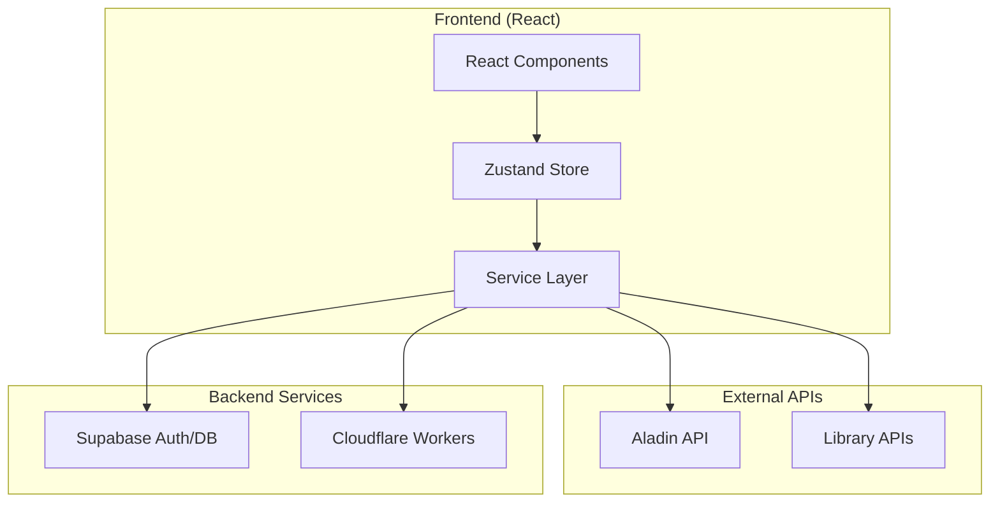

# 개발 가이드 (Development Guide)

마이북스테이션 프로젝트의 개발자를 위한 기술 문서입니다.

## 🎯 제품 요구사항 (Product Requirements)

### 서비스 비전
마이북스테이션은 도서 검색부터 재고 확인, 개인 서재 관리까지 원스톱으로 제공하는 통합 도서 서비스입니다.

### 핵심 비즈니스 요구사항
1. **통합 검색**: 알라딘 API를 통한 전국 도서 검색
2. **실시간 재고**: 여러 도서관 재고 상태 동시 확인
3. **개인 서재**: 사용자별 도서 관리 및 독서 기록
4. **접근성**: 직관적 UI/UX로 모든 사용자 지원

### 기능 우선순위
- **P0 (필수)**: 도서 검색, 재고 확인, 사용자 인증
- **P1 (중요)**: 개인 서재, 독서 상태 관리
- **P2 (개선)**: CSV 내보내기, 고급 정렬 옵션

## 🏗️ 시스템 아키텍처

### 전체 아키텍처 개요


### 프론트엔드 아키텍처
```
┌─────────────────────────────────────────────────┐
│                 React Components                │
├─────────────────────────────────────────────────┤
│          Zustand State Management               │
│  ┌─────────────┬─────────────┬─────────────┐    │
│  │ useUIStore  │useAuthStore │useBookStore │    │
│  └─────────────┴─────────────┴─────────────┘    │
├─────────────────────────────────────────────────┤
│                Service Layer                    │
│  ┌─────────────────┬─────────────────────────┐  │
│  │ aladin.service  │ unifiedLibrary.service  │  │
│  └─────────────────┴─────────────────────────┘  │
├─────────────────────────────────────────────────┤
│              External APIs                      │
│  ┌─────────────────┬─────────────────────────┐  │
│  │ Aladin API      │ Library Stock API       │  │
│  └─────────────────┴─────────────────────────┘  │
└─────────────────────────────────────────────────┘
```

### 상태 관리 의존성 구조
```
useUIStore (기본 UI 상태)
    ↑
useAuthStore (인증 상태)
    ↑  
useBookStore (비즈니스 로직)
```

## 📁 프로젝트 구조

```
my_bookstation/
├── components/              # React 컴포넌트
│   ├── layout/             # 레이아웃 관련 컴포넌트
│   │   ├── Header.tsx      # 상단 헤더 (로그인/로그아웃)
│   │   └── Footer.tsx      # 하단 푸터
│   ├── Auth.tsx            # 인증 폼
│   ├── AuthModal.tsx       # 인증 모달
│   ├── BookModal.tsx       # 도서 검색 결과 모달
│   ├── BookDetails.tsx     # 선택된 도서 상세 정보
│   ├── MyLibrary.tsx       # 개인 서재 관리
│   ├── MyLibraryBookDetailModal.tsx # 내 서재 상세 정보 모달
│   ├── LibraryStock.tsx    # 도서관 재고 정보
│   ├── SearchForm.tsx      # 도서 검색 폼
│   ├── StarRating.tsx      # 별점 평가 컴포넌트
│   ├── Notification.tsx    # 알림 메시지
│   ├── Spinner.tsx         # 로딩 스피너
│   ├── Icons.tsx           # Lucide React 아이콘 컴포넌트 (일관된 아이콘 시스템)
│   └── APITest.tsx         # API 테스트 컴포넌트 (개발용)
├── stores/                 # Zustand 상태 관리
│   ├── useAuthStore.ts     # 사용자 인증 상태
│   ├── useBookStore.ts     # 도서 및 서재 관련 상태
│   └── useUIStore.ts       # UI 상태 (모달, 로딩, 알림)
├── services/               # API 서비스 계층
│   ├── aladin.service.ts   # 알라딘 도서 검색 API
│   └── unifiedLibrary.service.ts  # 통합 도서관 재고 확인 API
├── lib/                    # 라이브러리 설정
│   └── supabaseClient.ts   # Supabase 클라이언트 초기화
├── library-checker/        # Cloudflare Workers 서버 (도서관 재고 확인 API)
│   └── src/index.js        # Workers 메인 스크립트
├── temp/                   # 임시 파일 및 테스트 파일 관리
│   ├── README.md          # temp 폴더 사용 가이드
│   ├── tests/             # 테스트 관련 파일들
│   │   ├── title-processing/ # 제목 처리 로직 테스트
│   │   ├── api-testing/   # API 연동 테스트
│   │   └── ui-testing/    # UI 관련 테스트
│   └── screenshots/       # 개발 과정 스크린샷
└── types.ts                # TypeScript 타입 정의
├── index.css               # 전역 스타일시트
```

## 🔧 기술 스택 상세

### Frontend Framework
- **React 19**: 최신 React 기능 및 훅 활용
- **TypeScript**: 정적 타입 체킹으로 런타임 에러 방지
- **Vite**: 빠른 HMR(Hot Module Replacement) 개발 환경

### 상태 관리
- **Zustand 4.5.4**: 
  - Redux 대비 간단한 보일러플레이트
  - TypeScript 완벽 지원
  - 분리된 스토어로 관심사 분리

### UI/UX
- **Tailwind CSS**: 유틸리티 우선 CSS 프레임워크
- **Lucide React**: 일관된 아이콘 시스템으로 전체 UI 통일
- **반응형 디자인**: 모바일 및 데스크톱 환경 지원
- **@tanstack/react-virtual**: 대용량 데이터 가상화 처리 (500-1000권 최적화)

### 데이터 검증
- **Zod 3**: 
  - 런타임 타입 검증
  - 외부 API 응답 안정성 보장
  - TypeScript 타입 추론 지원

### Backend & Authentication
- **Supabase**:
  - PostgreSQL 데이터베이스
  - 실시간 구독 기능
  - Row Level Security (RLS)
  - Google OAuth & 이메일/비밀번호 인증

### 서버리스 백엔드
- **Cloudflare Workers**:
  - 도서관 재고 크롤링
  - CORS 프록시 기능
  - 실시간 HTML 파싱
  - Supabase Keep-Alive 스케줄링

## 🚀 개발 환경 설정

### 필수 요구사항
- **Node.js**: 18.0 이상
- **npm**: 8.0 이상
- **Git**: 최신 버전

### 로컬 개발 설정

1. **저장소 클론**
   ```bash
   git clone <repository-url>
   cd my_bookstation
   ```

2. **의존성 설치**
   ```bash
   npm install
   ```

3. **환경 변수 설정**
   
   `.env.local` 파일 생성:
   ```bash
   # Supabase 설정
   VITE_SUPABASE_URL=https://your-project.supabase.co
   VITE_SUPABASE_ANON_KEY=your-anon-key
   
   # 개발 모드 설정
   VITE_DEV_MODE=true
   ```

4. **Cloudflare Workers 설정**
   
   `library-checker/.dev.vars` 파일 생성:
   ```bash
   # Supabase 연결 정보
   SUPABASE_URL=https://your-project.supabase.co
   SUPABASE_ANON_KEY=your-anon-key
   
   # 개발 환경 설정
   ENVIRONMENT=development
   DEBUG=true
   ```

5. **개발 서버 실행**
   ```bash
   # 메인 애플리케이션 실행
   npm run dev
   
   # Cloudflare Workers 실행 (별도 터미널)
   cd library-checker
   npm run dev
   ```

### Cloudflare Workers 서버 실행

1. **터미널에서 `library-checker` 디렉토리로 이동:**
   ```bash
   cd library-checker
   ```

2. **의존성 설치:**
   ```bash
   npm install
   ```

3. **개발 서버 시작:**
   ```bash
   npm run dev
   # 또는
   wrangler dev --test-scheduled --port 8787
   ```

4. **API 테스트:**
   ```bash
   # 상태 확인
   curl -X GET "http://127.0.0.1:8787"
   
   # 도서 검색 테스트
   curl -X POST "http://127.0.0.1:8787" \
     -H "Content-Type: application/json" \
     -d '{"isbn": "9788934985822", "title": "아몬드", "gyeonggiTitle": "아몬드"}'
   ```

## 🧪 테스트 파일 관리

### temp 폴더 사용 지침

프로젝트 개발 중 생성되는 테스트 파일들은 **반드시 `temp` 폴더 내에서 관리**해야 합니다.

#### 📁 temp 폴더 구조
- `temp/tests/title-processing/` - 제목 처리 로직 테스트
- `temp/tests/api-testing/` - API 연동 테스트  
- `temp/tests/ui-testing/` - UI 관련 테스트
- `temp/screenshots/` - 개발 과정 스크린샷

#### 🔧 테스트 파일 생성 규칙
1. **위치**: 프로젝트 최상단이 아닌 `temp/tests/` 하위에 생성
2. **명명**: `test_[기능명]_[날짜].[확장자]` 형식 사용
3. **정리**: 개발 완료 후 즉시 정리
4. **백업**: 중요한 실험 결과는 적절한 위치에 백업

#### ⚠️ 주의사항
- **금지**: 프로젝트 최상단에 테스트 파일 생성
- **보안**: 민감한 정보 포함 파일은 temp 폴더에도 저장 금지
- **정리**: 클로드 세션 종료 전 불필요한 파일들 정리
- **Git**: temp 폴더 대부분 파일은 `.gitignore`에 포함됨

#### 💡 베스트 프랙티스
1. 테스트 전 `temp/README.md` 가이드라인 확인
2. 테스트 파일은 해당 기능별 폴더에 분류
3. 세션 종료 시 또는 기능 개발 완료 시 정리
4. 장기적으로 필요한 파일만 적절한 위치로 이동

### 디버깅 워크플로우
1. **문제 정의** → 2. **temp/tests/에 테스트 파일 생성** → 3. **실험 및 검증** → 4. **결과 적용** → 5. **테스트 파일 정리**

## 📊 API 명세

### 알라딘 도서 검색 API
- **엔드포인트**: `http://www.aladin.co.kr/ttb/api/ItemSearch.aspx`
- **인증**: TTB Key 필요
- **응답 형식**: JSON/XML
- **주요 파라미터**:
  - `Query`: 검색어
  - `QueryType`: 검색 유형 (Title, Author, Publisher 등)
  - `MaxResults`: 최대 결과 수
  - `output`: 출력 형식 (JSON)

### 통합 도서관 재고 API (Cloudflare Workers)
- **로컬**: `http://127.0.0.1:8787`
- **프로덕션**: `https://library-checker.byungwook-an.workers.dev`
- **메서드**: POST
- **요청 형식**:
  ```json
  {
    "isbn": "9788934985822",
    "title": "아몬드",
    "gyeonggiTitle": "아몬드"
  }
  ```
- **응답 형식**:
  ```json
  {
    "gwangju_paper": {
      "book_title": "도서 제목",
      "availability": [...]
    },
    "gyeonggi_ebooks": [...],
    "gyeonggi_ebook_library": {
      "library_name": "경기도 전자도서관",
      "total_count": 1,
      "available_count": 1,
      "books": [...]
    }
  }
  ```

### 제목 처리 로직

#### 기본 도서관용 제목 처리 (processBookTitle)
```typescript
function processBookTitle(title: string): string {
  // 한글 외의 문자를 공백으로 변경
  const processedTitle = title.replace(/[^가-힣\s]/g, ' ');
  
  // 공백으로 분리하고 빈 문자열 제거
  const chunks = processedTitle.split(' ').filter(chunk => chunk.trim() !== '');
  
  // 3개 이하면 그대로 반환, 3개 초과면 첫 3개만 반환
  return chunks.length <= 3 ? chunks.join(' ') : chunks.slice(0, 3).join(' ');
}
```

#### 경기도 전자도서관용 제목 처리 (processGyeonggiEbookTitle)
```typescript
function processGyeonggiEbookTitle(title: string): string {
  // 특수문자 목록 (쉼표, 하이픈, 콜론, 세미콜론, 괄호 등)
  const specialChars = /[,\-:;()[\]{}]/;
  
  // 특수문자가 있으면 그 위치까지만 추출
  let processedTitle = title;
  const match = title.search(specialChars);
  if (match !== -1) {
    processedTitle = title.substring(0, match).trim();
  }
  
  // 공백으로 분리하고 빈 문자열 제거
  const words = processedTitle.split(' ').filter(word => word.trim() !== '');
  
  // 최대 3단어까지만 사용
  return words.slice(0, 3).join(' ');
}
```

## 🔒 보안 고려사항

### 환경 변수 관리
- **개발**: `.env.local` 파일 사용 (Git 제외)
- **프로덕션**: Vercel/Netlify 환경 변수 설정
- **Workers**: `.dev.vars` 파일 사용 (Git 제외)

### API 키 보호
- 클라이언트 사이드에서 민감한 키 노출 금지
- Cloudflare Workers를 통한 API 프록시
- Supabase RLS(Row Level Security) 활용

### 사용자 데이터 보호
- Supabase의 내장 보안 기능 활용
- 사용자별 데이터 격리
- HTTPS 강제 사용

## 🐛 트러블슈팅

### 일반적인 문제들

1. **CORS 에러**
   - 개발 환경: corsproxy.io 사용
   - 프로덕션 환경: 백엔드 프록시 설정 필요

2. **알라딘 API 응답 지연**
   - 타임아웃 설정 확인 (30초)
   - 네트워크 상태 점검

3. **Supabase 연결 에러**
   - 환경 변수 확인
   - Row Level Security (RLS) 정책 확인

4. **가상화 테이블 성능 이슈**
   - 데이터량에 따른 동적 가상화 설정 확인
   - `estimateSize` 값과 실제 행 높이 일치 여부 검증
   - `overscan` 값 조정으로 스크롤 성능 최적화

5. **Cloudflare Workers 디버깅**
   ```bash
   # 실시간 로그 확인
   wrangler tail
   
   # 로컬 디버깅
   wrangler dev --test-scheduled --port 8787
   ```

### 성능 최적화

1. **번들 크기 최적화**
   ```bash
   # 번들 분석
   npm run build
   npm run analyze
   ```

2. **가상화 설정 최적화**
   - 대용량 데이터 처리 시 `@tanstack/react-virtual` 사용
   - 적절한 `overscan` 값 설정

3. **API 응답 캐싱**
   - 브라우저 캐시 활용
   - 적절한 Cache-Control 헤더 설정

### 디버깅 도구
- **React Developer Tools**: 컴포넌트 상태 확인
- **Browser DevTools**: 네트워크 요청 모니터링
- **Zustand DevTools**: 상태 변화 추적
- **Wrangler Tail**: Cloudflare Workers 로그 실시간 확인

## 🚀 배포

### 프론트엔드 배포 (Vercel)
1. **Vercel 프로젝트 생성**
2. **환경 변수 설정**
3. **자동 배포 설정**

### Cloudflare Workers 배포
```bash
cd library-checker
npm run deploy
```

### 환경별 설정
- **개발**: 로컬 개발 서버
- **스테이징**: 테스트용 배포 환경
- **프로덕션**: 실제 서비스 환경

## 📋 코딩 컨벤션

### TypeScript 규칙
- 모든 함수와 변수에 타입 명시
- `interface` 사용 권장 (`type` 대신)
- Enum보다는 Union Type 사용

### React 컨벤션
- 함수형 컴포넌트 사용
- Custom Hook 활용으로 로직 분리
- Props는 interface로 정의

### 파일 구조 규칙
- 컴포넌트는 PascalCase
- 서비스 파일은 camelCase.service.ts
- 타입 정의는 별도 파일로 분리

### UI/UX 컨벤션
- **아이콘 시스템**: `components/Icons.tsx`에서 통일된 Lucide React 아이콘 사용
- **아이콘 사용법**: 직접 Lucide import 금지, Icons.tsx의 래핑된 컴포넌트 사용
- **아이콘 크기**: `w-3 h-3` (작은), `w-5 h-5` (일반), `w-6 h-6` (큰) 표준 사용
- **아이콘 색상**: Tailwind 색상 시스템 준수 (`text-green-500`, `text-red-400` 등)

## 📚 참고 자료

### 공식 문서
- [React 19 Documentation](https://react.dev/)
- [TypeScript Handbook](https://www.typescriptlang.org/docs/)
- [Vite Guide](https://vitejs.dev/guide/)
- [Supabase Docs](https://supabase.com/docs)
- [Cloudflare Workers](https://developers.cloudflare.com/workers/)

### 사용된 라이브러리
- [Zustand](https://github.com/pmndrs/zustand)
- [Tailwind CSS](https://tailwindcss.com/)
- [Lucide React](https://lucide.dev/guide/packages/lucide-react)
- [Zod](https://zod.dev/)
- [React Virtual](https://tanstack.com/virtual/v3)

---

**문서 최종 수정일**: 2025-08-09  
**작성자**: 개발팀